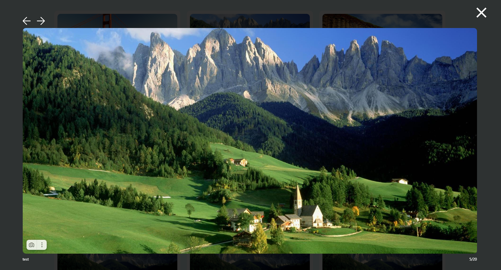

<h1>Тестовое задание CaseLab</h1>

<h2>Описание:</h2>
Этот проект представляет собой приложение для галереи фотографий, созданное с использованием React, MobX для управления состоянием и Directus для управления бэкендом. Приложение позволяет пользователям загружать фотографии через панель администрирования Directus и просматривать их на фронтенде. Также поддерживается просмотр фотографий в модальном окне, навигация между фотографиями и управление приложением с помощью Docker.

<h2>Возможности:</h2>
<ul>
<li>Загрузка фотографий через панель администрирования Directus</li>
<li>Отображение списка загруженных фотографий</li>
<li>Просмотр фотографий в большем размере в модальном окне</li>
<li>Навигация между фотографиями внутри модального окна</li>
<li>Адаптивный дизайн</li>
<li>Пагинация для списка фотографий</li>
<li>Dockerized настройка для фронтенда и бэкенда</li>
</ul>

<h2>Начало работы</h2>
<h3>Убедитесь, что у вас установлены следующие компоненты:</h3>
<ul>
<li>Node.js</li>
<li>Docker</li>
<li>Docker Compose</li>
</ul>
<h2>Установка и запуск</h3>

### Клонировать репозиторий:

    git@github.com:opigon1/case-lab-test.git

    cd case-lab-test

### Настройка и запуск Docker приложения:

    # Запустите  Docker на своём ПК

    docker-compose up --build

### Фронтенд будет доступен по адресу: http://localhost

### Админка Directus по адресу: http://localhost/directus

### Логин: admin@example.com

### Пароль: d1r3ctu5

## Скриншоты

### Пагинация карточек

### Пагинация карточек

### Колекция карточек

### Адаптив

### Путь directus http://localhost/directus

